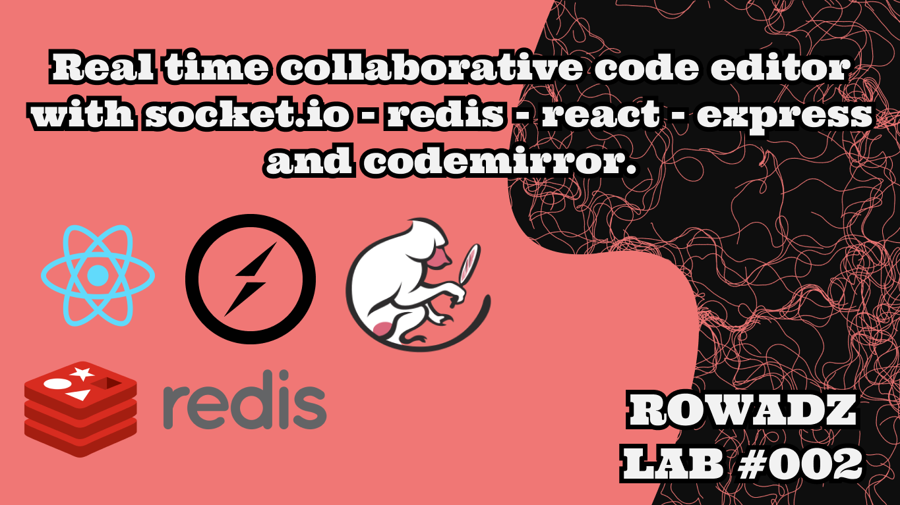

# Real time collaborative code editor with codemirror
 
 Video:
 https://youtu.be/gq4dDiZNXCI



# Notes

previous lab repo:
https://github.com/MohammedAl-Rowad/caskbrewer

Lab playlist:
https://youtube.com/playlist?list=PLM0LBHjz37LU9wTI6mttZ5qeu5F3hcotf

# How to install & run it locally

```bash
$ git clone https://github.com/MohammedAl-Rowad/real-time-collaborative-code-editor.git
$ cd real-time-collaborative-code-editor
$ npm i 
$ npm run dev
```
